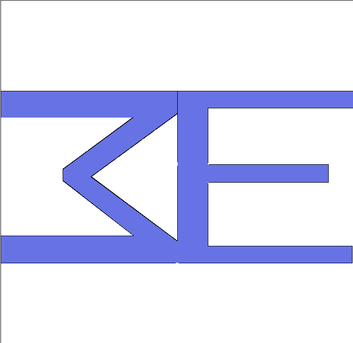
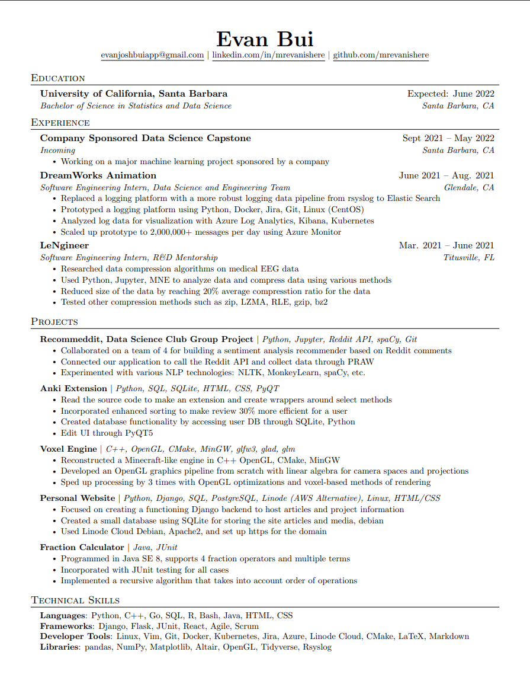

# Evan

- [About](#about)
- [Contact](#contact)
- [Portfolio](#portfolio)
- [Media](#media)
- [Self Study](#self-study)

# About
Hey. I'm Evan. A stats and data science major graduating this June. Interested in data, cs, language, gaming, reading, art, music, health, etc. This is a site for one of my courses. 

# Contact

# Portfolio
## Resume 10/4/2021

## Projects
### Voxel Engine

Technologies: C++, OpenGL (GLFW3, GLAD, GLM), CMake, MinGW

### Django Site (My Website)

Technologies: Python, Django, Debian (Linode), Apache (Server), PostgreSQL / SQLite, CSS, HTML

### Anki Add-on

Technologies: Python, PyQT, SQLite, HTML, CSS

## Relevant Coursework

- Technical Writing
- C++ Programming
- Data Science Capstone
- Data Science Principles (R, SQL)
- Statistical Data Science (Python)
- Probability and Statistics (R)
- Java Programming
- Computer Science Principles (JavaScript)
- Linear Algebra with Applications
- Multivariable Calculus
- Differential Equations
- Transition to Higher Math (Discrete Math)

# Media 

## Favorite Books

* On The Shortness of Life by Seneca
    * This book taught me how important my time is. 
* goodbye, things by Sasaki Fumio
    * One of my favorite books because it taught me how important my space is.

* Paradox of Choice by Barry Schwartz
    * One of my favorite books because it showed me that over optimizing is not worth it.

## Favorite Shows
* Avatar The Last Airbender
* Violet Evergarden
* Star Wars: The Clone Wars

## Favorite Games
* Portal 2
* Minecraft
* Danganronpa 3

# Self Study
## What I'm Reading Now
* Introduction to Algorithms by CLRS
* 新完全マスター読解 N1 (Shin Kanzen Master Reading Comprehension N1)

