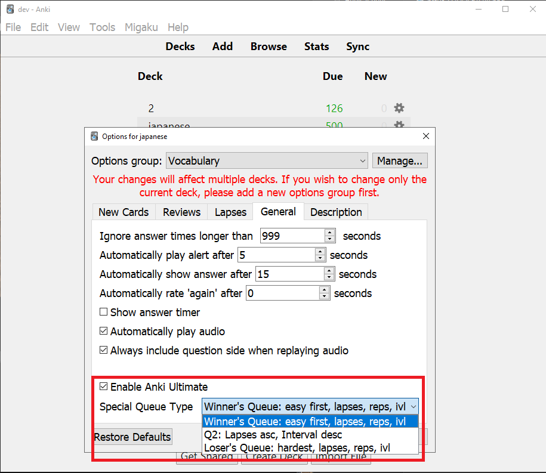

# Evan

- [About](#about)
- [Portfolio](#portfolio)
- [Media](#media)
- [Self Study](#self-study)
- [Contact](#contact)

# About
Hey. I'm Evan. 
* Github Site
* Assignment
* 
# Portfolio
## My Current Resume

## Projects
### Voxel Engine

Technologies: C++, OpenGL (GLFW3, GLAD, GLM), CMake, MinGW

### Django Site (My Website)

Technologies: Python, Django, Debian (Linode), Apache (Server), PostgreSQL / SQLite, CSS, HTML

### Anki Add-on

Technologies: Python, PyQT, SQLite, HTML, CSS

# Media 
## Favorite Books

* 
# Self Study
## What I'm Reading Now
* CS:APP
* 新完全マスター読解

# Contact

